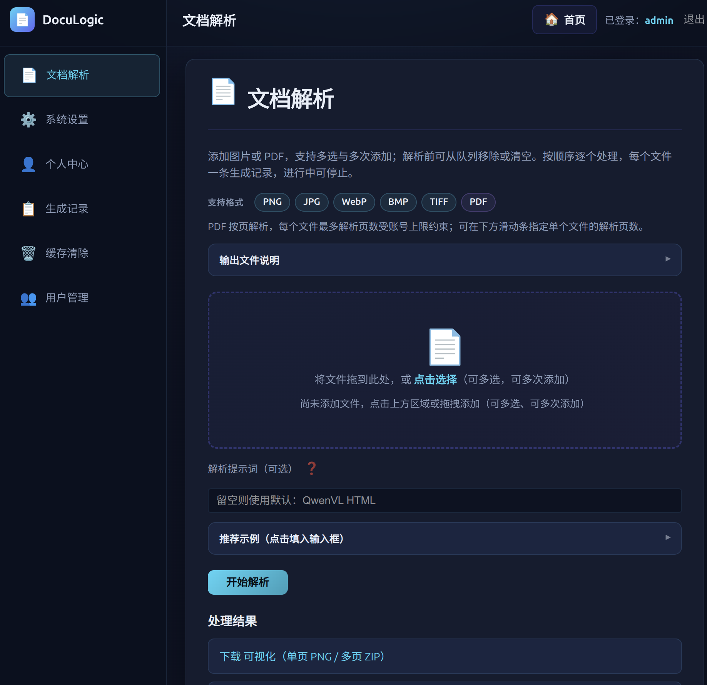
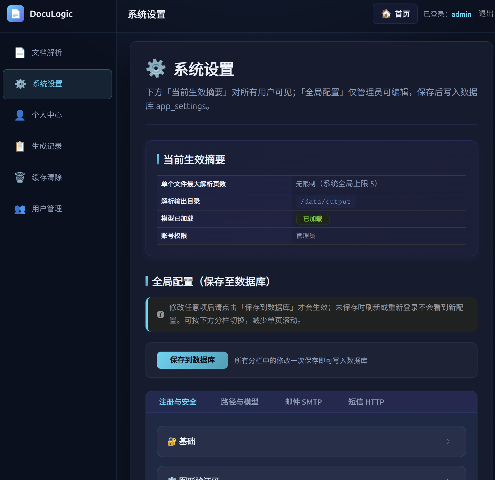
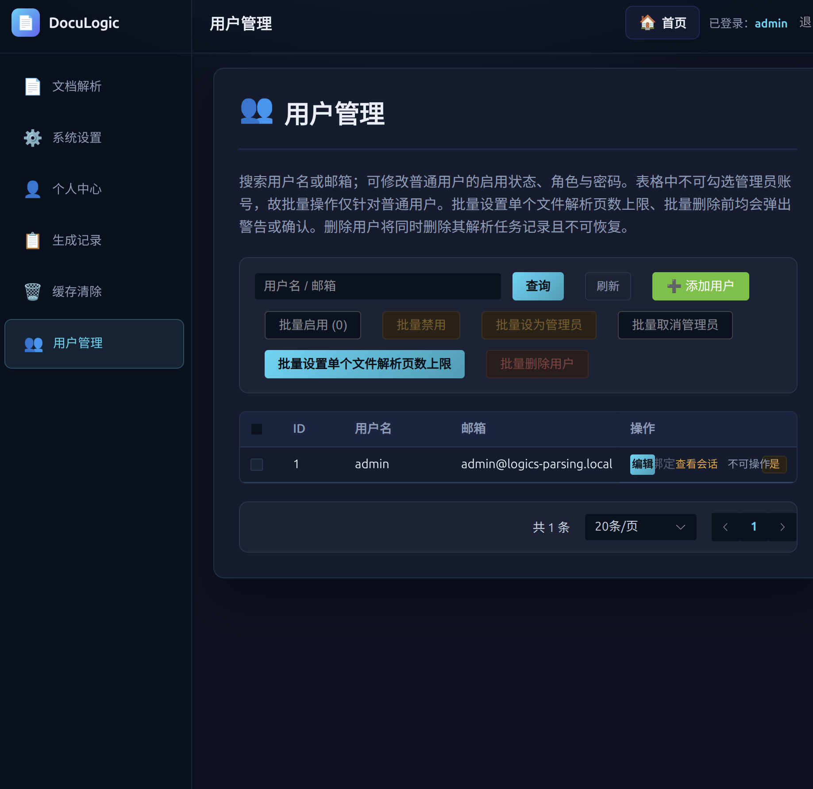
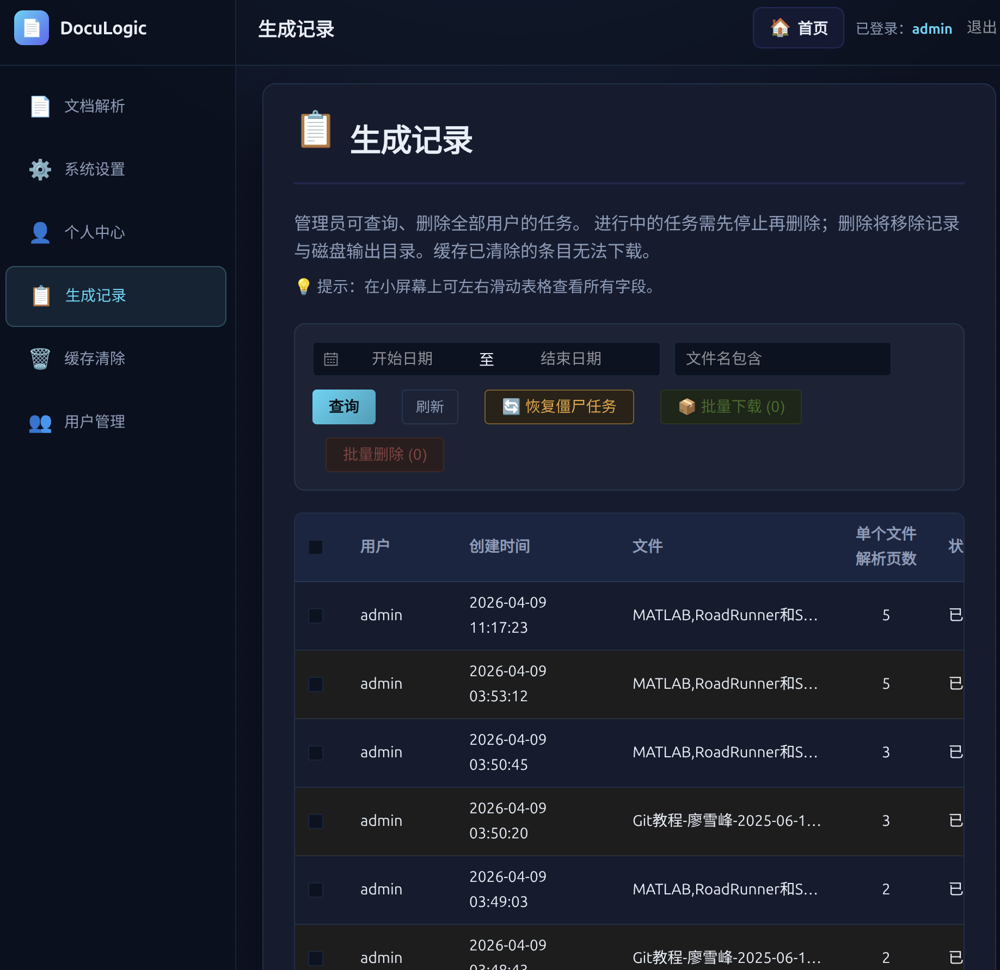

# DocuLogic v2.4

<div align="center">

**智能文档解析与结构化平台 | Intelligent Document Parsing & Structuring Platform**

[](https://www.python.org/)
[](https://fastapi.tiangolo.com/)
[](https://vuejs.org/)
[](https://www.docker.com/)
[](LICENSE)

[🚀 快速开始](#-快速开始) • [📸 功能展示](#-功能展示) • [🏗️ 架构设计](#️-架构设计) • [📝 API 文档](#-api-文档)

</div>

## 📖 项目简介

DocuLogic 是基于阿里巴巴 **Logics-Parsing-v2** 模型的企业级文档解析平台，支持 PDF、图片等多格式文档的结构化转换。

### ✨ 核心特性

- **🎯 强大解析能力**：端到端单模型，支持 STEM 内容（公式、化学结构）、复杂版面、Parsing-2.0（流程图、乐谱）
- **👥 完善用户系统**：注册登录、SSO 单点登录、异地登录检测、强制登出
- **⚙️ 灵活配置管理**：动态调整解析参数、文件上传控制、多数据库支持（SQLite/MySQL/PostgreSQL/MariaDB）
- **📊 全面任务管理**：WebSocket 实时进度、历史记录查询、多种输出模式（Base64/独立文件/不输出）
- **🔐 企业级安全**：JWT + Token 黑名单、7 个安全响应头、日志脱敏、速率限制

## 🚀 快速开始

### 前置要求

- Python 3.10+ / Node.js 18+（本地开发）
- Docker & Docker Compose（推荐部署）
- 16GB+ RAM，GPU 推荐（CPU 也可运行）

---

### 🐳 Docker 一键部署（⭐ 推荐）

```bash
# 1. 克隆项目
git clone https://github.com/syd168/DocuLogic.git
cd DocuLogic

# 2. 一键部署（自动完成环境检查、密钥生成、服务启动）
./docker/deploy.sh

# 3. 访问应用
# http://localhost:8030
# 默认账号: admin / admin123
```

**部署脚本自动完成：**
- ✅ 检查 Docker、GPU 环境
- ✅ 创建数据目录（~/doculogic/）
- ✅ 下载模型权重（如需要）
- ✅ 生成安全密钥（JWT_SECRET）
- ✅ 启动服务（主应用 + Redis + SQLite/MySQL/PostgreSQL/MariaDBt）

#### 常用 Docker 命令

```bash
cd docker

# 启动/停止/重启
docker compose up -d
docker compose down
docker compose restart

# 查看日志
docker logs -f doculogic

# 进入容器
docker exec -it doculogic bash

# 更新版本
git pull origin main
docker compose down && docker compose up -d --build
```

#### 环境变量配置

编辑 `docker/.env` 文件：

| 变量 | 说明 | 默认值 |
|------|------|--------|
| `HOST_PORT` | 访问端口 | `8030` |
| `GPU_COUNT` | GPU 数量（0=禁用） | `1` |
| `DATABASE_TYPE` | 数据库类型 | `mysql` |
| `MEM_LIMIT` | 内存限制 | `8g` |

> 📖 **详细文档**：[docker/README.md](docker/README.md)

---

### 💻 本地开发部署

```bash
# 1. 克隆项目并下载模型
git clone https://github.com/syd168/DocuLogic.git
cd DocuLogic
python logics-parsingv2/download_model_v2.py

# 2. 安装依赖
python -m venv venv && source venv/bin/activate
pip install -r requirements.txt
cd frontend && npm install && cd ..

# 3. 配置环境变量
cp .env.example .env
# 编辑 .env，设置 MODEL_PATH、JWT_SECRET 等

# 4. 启动服务
./start.sh

# 访问
# 前端: http://localhost:5173
# API:  http://localhost:8000/api/docs
```

## 📸 功能展示

### 文档解析
- 拖拽上传或选择文件，支持批量上传

- 实时进度显示，PDF 页数自定义

- 可视化预览（PNG/ZIP），Markdown 下载

  

### 后台管理

- 系统设置（注册、验证码、解析限制）

  

- 用户管理（CRUD + 批量操作）

  

- 生成记录查询与清理

  

- 模型下载与重载

  

### 技术栈

**后端**：FastAPI + SQLAlchemy + JWT + Redis  
**前端**：Vue 3 + Element Plus + Vite  
**基础设施**：Docker + Nginx + MySQL/SQLite等  
**AI 模型**：Logics-Parsing-v2 (PyTorch + Transformers)

## 📂 项目结构

```
DocuLogic/
├── docker/                  # Docker 部署
│   ├── deploy.sh            # 一键部署脚本
│   └── docker-compose.yml   # 服务编排
├── frontend/                # Vue 3 前端
│   └── src/views/           # 页面组件
├── web/                     # FastAPI 后端
│   └── app/
│       ├── routers/         # API 路由
│       ├── models.py        # 数据模型
│       └── main.py          # 入口文件
├── logics-parsingv2/        # AI 模型
└── README.md
```

## 🔧 配置说明

### 系统设置（管理员）

登录管理后台可调整：

| 配置项 | 说明 | 默认值 |
|--------|------|--------|
| PDF 最大解析页数 | 单次解析允许的最大页数 | 80 |
| 图片输出模式 | base64/separate/none | base64 |
| 注册开关 | 是否允许新用户注册 | true |
| 验证码开关 | 登录/注册验证码 | false |

### 环境变量

详见 `.env.example`。关键配置：

| 变量名 | 说明 | 示例 |
|--------|------|------|
| `MODEL_PATH` | 模型权重路径 | `./weights/Logics-Parsing-v2` |
| `OUTPUT_DIR` | 解析输出目录 | `./out` |
| `ADMIN_USERNAMES` | 管理员用户名 | `admin` |
| `DATABASE_TYPE` | 数据库类型 | `mysql` / `sqlite` |

## 🚀 版本历史

### v2.4.0 (最新)
- ✨ 修复 ZIP 下载逻辑（separate 模式始终生成 ZIP）
- ✨ 前端动态判断是否显示 ZIP 下载按钮
- 🐛 修复 assets 目录不存在时的 FileNotFoundError
- 📝 添加 Windows Docker 部署说明和路径配置提示
- 🔧 优化调试日志输出

### v2.3.0
- ✨ UI/UX 全面优化（图标动画统一、文案精简）
- 🐛 修复上传 500 错误（ParseJob 重复导入）
- 📖 完善文档和 GitHub 链接

### v2.2.0

- ✨ 单点登录友好提示
- ✨ 文件上传精细控制（多文件开关、自定义大小）
- ✨ UI 优化（折叠面板图标、视觉层次）

### v2.0.0
- ✨ 企业级安全防护（7 个安全响应头、错误脱敏）
- ✨ 自动化运维（数据库自动备份）
- ✨ UI/UX 重构（卡片式布局、Tooltip 优化）

## ⚠️ 注意事项

### 硬件要求
- **显存**：建议 16GB+ GPU（CPU 也可，速度慢 5-10 倍）
- **内存**：至少 16GB RAM，建议 32GB+
- **磁盘**：模型 10GB + 输出预留 50GB+

### 常见问题

**Q: 部署后无法访问？**  
A: 检查防火墙开放 8030 端口，查看日志 `docker logs doculogic`

**Q: 模型加载失败？**  
A: 确认 `MODEL_PATH` 正确，检查 GPU 驱动

**Q: 如何备份数据？**  

```bash
# MySQL 备份
docker exec doculogic-mysql mysqldump -uroot -p${MYSQL_PASSWORD} doculogic > backup.sql

# 解析结果备份
tar -czf output_backup.tar.gz ~/doculogic/data/output/
```

**Q: 如何更新到最新版本？**  
```bash
git pull origin main
cd docker && docker compose down && docker compose up -d --build
```

## 📝 许可证

本项目采用 Apache 2.0 许可证。详见 [LICENSE](LICENSE) 文件。

## 🙏 致谢

- [Logics-Parsing-v2](https://github.com/alibaba/Logics-Parsing) - 阿里巴巴开源的文档解析模型
- [FastAPI](https://fastapi.tiangolo.com/) - 高性能 Python Web 框架
- [Vue 3](https://vuejs.org/) - 渐进式 JavaScript 框架

## 📧 联系方式

- 项目主页：[GitHub Repository](https://github.com/syd168/DocuLogic)
- 模型主页：[HuggingFace](https://huggingface.co/Logics-MLLM/Logics-Parsing-v2)
- 在线演示：[ModelScope](https://www.modelscope.cn/studios/Alibaba-DT/Logics-Parsing/summary)

---

**如果这个项目对你有帮助，请考虑给它一个 ⭐ Star！**

Made with ❤️ by the DocuLogic Team

[📄 Apache 2.0 License](LICENSE) • [🐛 报告问题](https://github.com/syd168/DocuLogic/issues) • [💡 提出建议](https://github.com/syd168/DocuLogic/issues)
