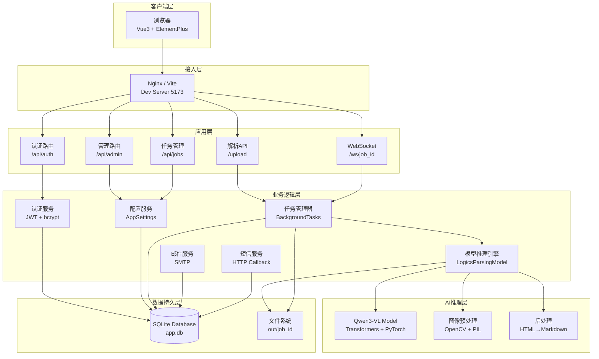
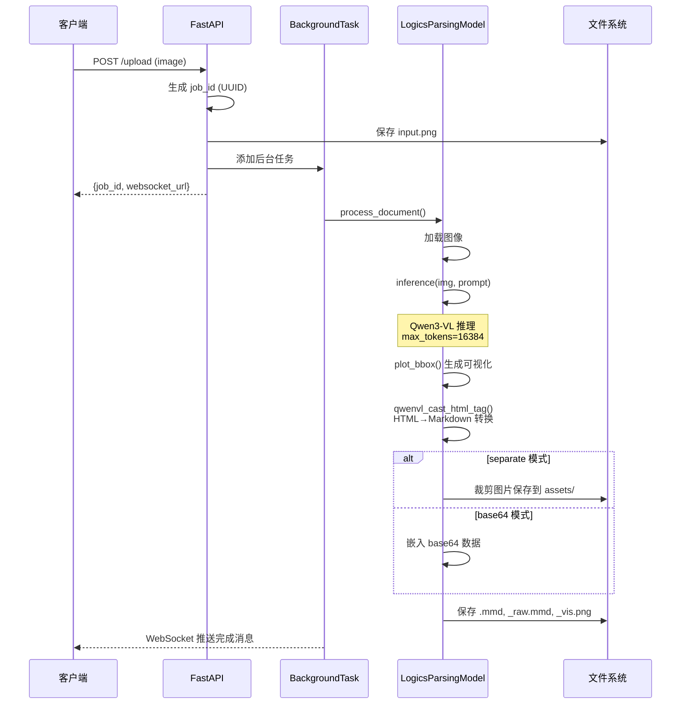
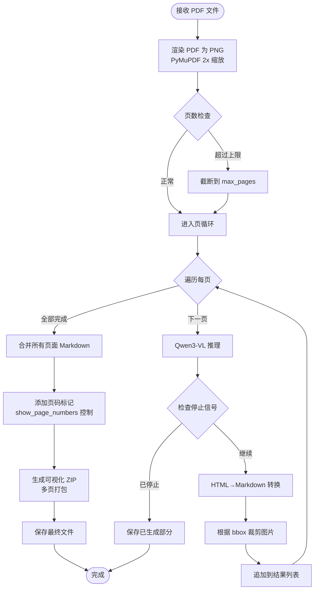
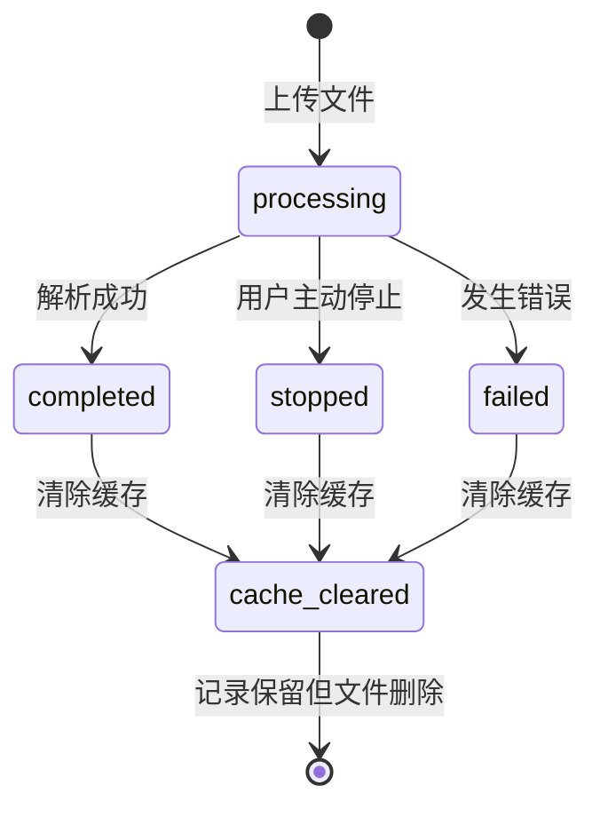
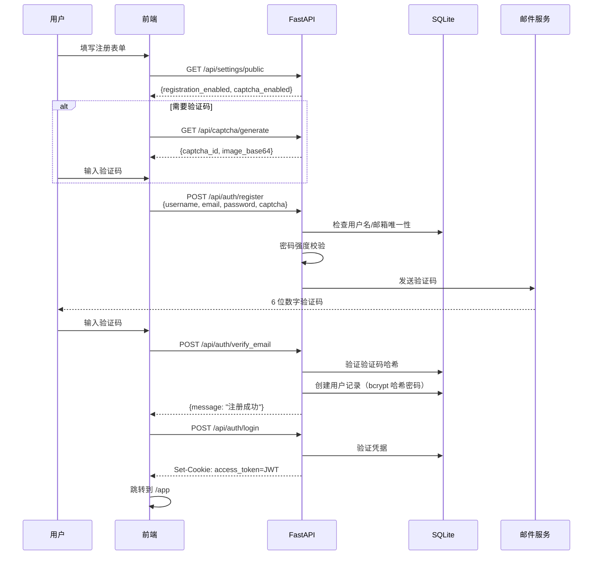
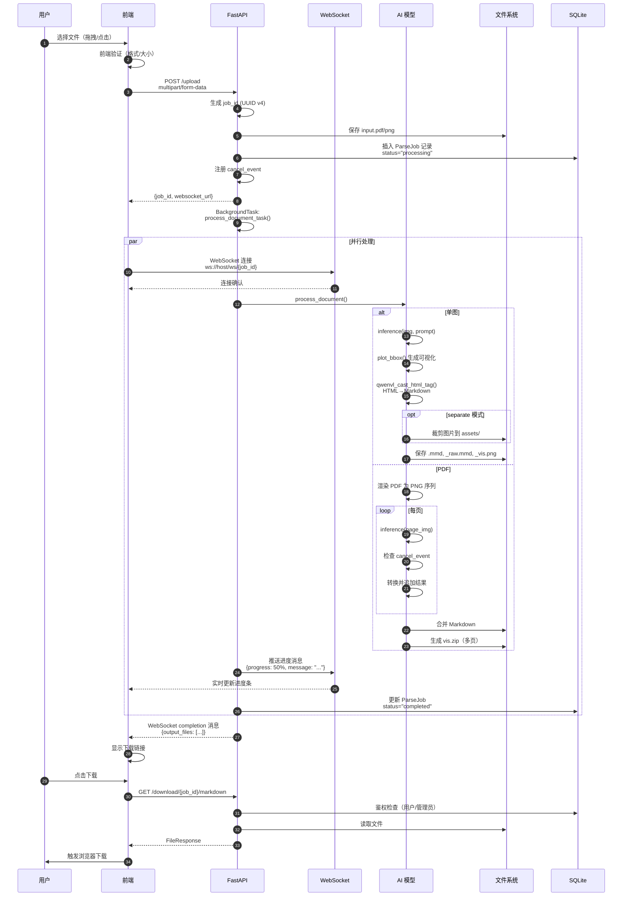
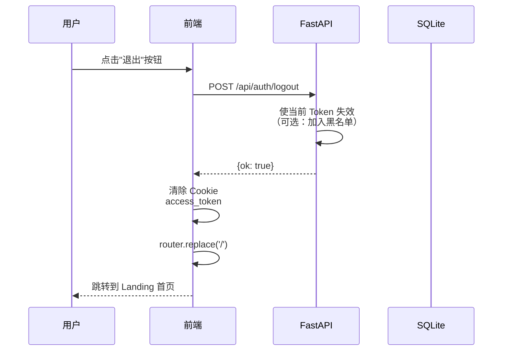
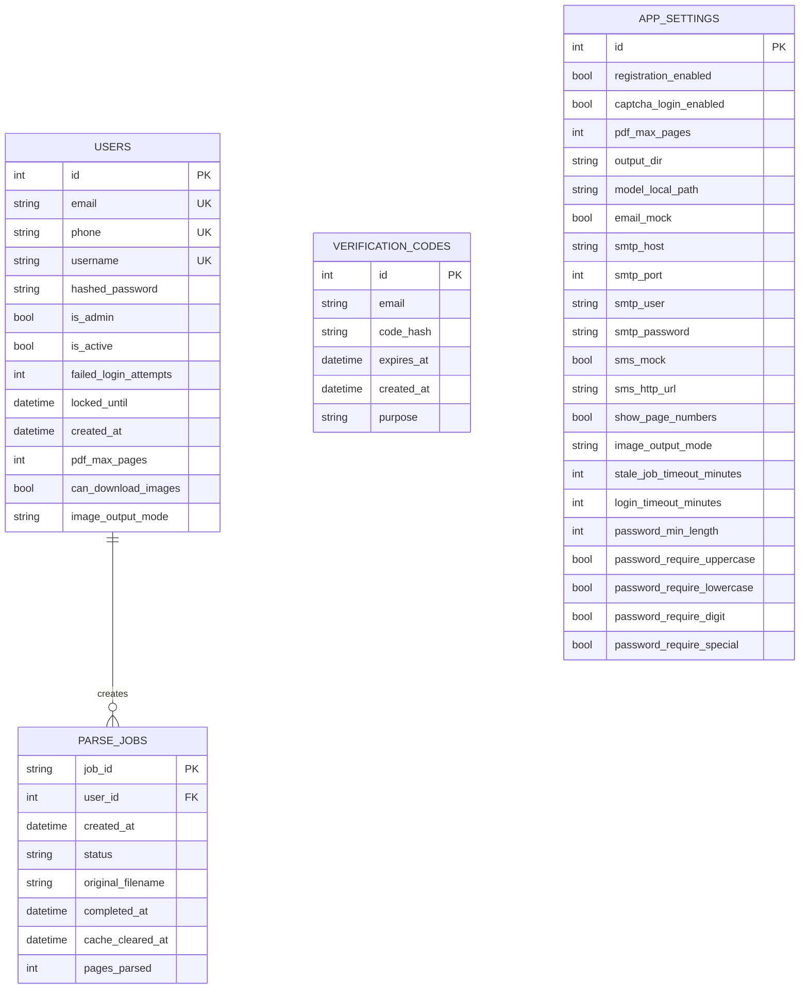

# DocuLogic 智能文档解析平台 - 技术方案文档

## 📋 目录

- [1. 项目概述](#1-项目概述)
- [2. 系统架构](#2-系统架构)
- [3. 技术栈详解](#3-技术栈详解)
- [4. 核心模块设计](#4-核心模块设计)
- [5. 数据流与业务流程](#5-数据流与业务流程)
- [6. 数据库设计](#6-数据库设计)
- [7. API 接口设计](#7-api-接口设计)
- [8. 安全机制](#8-安全机制)
- [9. 部署架构](#9-部署架构)
- [10. 性能优化](#10-性能优化)

---

## 1. 项目概述

### 1.1 产品定位

DocuLogic 是一个基于多模态大语言模型（MLLM）的智能文档解析平台，能够将扫描件、截图、PDF 等非结构化文档精准转换为结构化的 Markdown 格式，支持表格、公式、流程图、化学式、乐谱等复杂元素的识别与还原。

### 1.2 核心价值

- **高精度解析**：基于 Qwen-VL 多模态大模型，实现像素级文档理解
- **结构化输出**：生成符合规范的 Markdown，包含 Mermaid 流程图、LaTeX 公式等
- **智能图像处理**：根据 AI 输出的 bbox 坐标精确裁剪图片区域
- **多用户隔离**：完整的用户认证、权限管理和数据隔离机制
- **实时进度追踪**：WebSocket 实时推送解析进度，支持中途停止

### 1.3 应用场景

| 场景 | 说明 |
|------|------|
| 学术研究 | 论文、研报中的图表、公式与摘要结构化 |
| 企业文档数字化 | 财报、合同、报表等扫描件的结构化还原 |
| 教育培训 | 课件截图、讲义 PDF 转为可编辑大纲 |
| 档案管理 | 批量处理票据、表单、档案类扫描件 |
| 科研数据处理 | 实验报告、科学图表的自动化解析 |

---

## 2. 系统架构

### 2.1 整体架构图

> **架构设计说明**：DocuLogic 采用经典的分层架构设计，从客户端到 AI 推理层共分为 6 个层次。这种设计确保了各模块职责清晰、耦合度低，便于独立开发、测试和维护。系统通过 FastAPI 提供高性能的 RESTful API 和 WebSocket 实时通信，后端集成 Qwen3-VL 多模态大模型实现智能文档解析。



> **架构特点总结**：
> - **前后端分离**：Vue 3 前端与 FastAPI 后端通过 HTTP/WebSocket 通信
> - **异步非阻塞**：FastAPI 原生支持异步编程，提升并发处理能力
> - **任务队列**：使用 BackgroundTasks 实现异步文档解析，避免阻塞主线程
> - **实时推送**：WebSocket 实时推送解析进度，提升用户体验
> - **模块化设计**：认证、配置、推理、任务管理等模块职责明确
> - **可扩展性**：AI 推理层独立，可轻松替换或升级模型

### 2.2 分层架构说明

#### 2.2.1 表现层（Presentation Layer）
- **前端框架**：Vue 3 Composition API + Vite 构建工具
- **UI 组件库**：Element Plus（企业级 UI 组件）
- **状态管理**：Vue 响应式系统（ref/reactive）
- **路由管理**：Vue Router 4（SPA 路由守卫）
- **HTTP 客户端**：Axios（拦截器 + 自动携带 Cookie）

#### 2.2.2 应用层（Application Layer）
- **Web 框架**：FastAPI（异步高性能 Python Web 框架）
- **路由模块**：
  - `auth_router.py`：用户认证（注册/登录/找回密码）
  - `admin_router.py`：管理员功能（系统设置/模型管理/用户管理）
  - `captcha_api.py`：图形验证码生成与验证
- **中间件**：
  - CORS 中间件：跨域资源共享
  - Rate Limiter（SlowAPI）：速率限制防护
  - Static Files：静态资源服务

#### 2.2.3 业务逻辑层（Business Logic Layer）
- **模型推理引擎**：`model_inference.py`
  - 单图处理流程
  - PDF 分页处理流程
  - 图片裁剪与输出模式管理
- **任务管理器**：`job_events.py`
  - 后台任务调度（BackgroundTasks）
  - 取消事件管理（threading.Event）
  - 僵尸任务检测与恢复
- **配置服务**：`settings_service.py`
  - 全局配置读取
  - 用户个性化配置
  - 配置优先级管理

#### 2.2.4 数据访问层（Data Access Layer）
- **ORM 框架**：SQLAlchemy 2.0（类型安全的 ORM）
- **数据库**：SQLite（轻量级嵌入式数据库）
- **文件存储**：本地文件系统（可配置输出目录）

#### 2.2.5 AI 推理层（AI Inference Layer）
- **基础模型**：Qwen3-VL-ForConditionalGeneration
- **推理框架**：HuggingFace Transformers + PyTorch
- **硬件加速**：CUDA GPU（bfloat16 精度）
- **注意力机制**：SDPA（Scaled Dot Product Attention）

---

## 3. 技术栈详解

### 3.1 后端技术栈

#### 3.1.1 FastAPI 框架特性

```
python
# 核心特性示例
from fastapi import FastAPI, Depends, BackgroundTasks, WebSocket
from pydantic import BaseModel

app = FastAPI(title="DocuLogic Platform")

# 1. 自动 API 文档（Swagger UI + ReDoc）
# 访问 http://localhost:8000/api/docs

# 2. 依赖注入系统
def get_db():
    db = SessionLocal()
    try:
        yield db
    finally:
        db.close()

# 3. 异步支持
@app.post("/upload")
async def upload_document(
    background_tasks: BackgroundTasks,
    current_user: User = Depends(get_current_user)
):
    # 异步处理文件上传
    background_tasks.add_task(process_document_task, ...)
```
**优势**：
- ✅ 基于 Starlette 和 Pydantic，性能媲美 Node.js 和 Go
- ✅ 自动生成 OpenAPI 规范文档
- ✅ 类型提示驱动的数据验证
- ✅ 原生支持 WebSocket 和异步编程

#### 3.1.2 SQLAlchemy ORM

```
python
# 现代化 ORM 使用方式（SQLAlchemy 2.0）
from sqlalchemy.orm import Mapped, mapped_column, relationship

class User(Base):
    __tablename__ = "users"
    
    id: Mapped[int] = mapped_column(Integer, primary_key=True)
    username: Mapped[str] = mapped_column(String(64), unique=True)
    email: Mapped[str] = mapped_column(String(255), unique=True)
    is_admin: Mapped[bool] = mapped_column(Boolean, default=False)
    
    # 关系映射
    jobs: Mapped[list["ParseJob"]] = relationship("ParseJob", back_populates="user")
```
**特性**：
- 类型安全的查询构建
- 懒加载与急加载策略
- 事务管理与会话池
- 迁移工具 Alembic 集成

#### 3.1.3 JWT 认证机制

```
python
# Token 生成
from jose import jwt

def create_access_token(data: dict, expires_delta: timedelta = None):
    to_encode = data.copy()
    expire = datetime.utcnow() + (expires_delta or timedelta(minutes=30))
    to_encode.update({"exp": expire})
    return jwt.encode(to_encode, SECRET_KEY, algorithm=ALGORITHM)

# Token 验证
def decode_token(token: str):
    try:
        payload = jwt.decode(token, SECRET_KEY, algorithms=[ALGORITHM])
        return payload
    except JWTError:
        return None
```
**安全特性**：
- HMAC-SHA256 签名算法
- Token 过期时间控制
- HttpOnly Cookie 存储（防 XSS）
- Refresh Token 机制（可选扩展）

### 3.2 前端技术栈

#### 3.2.1 Vue 3 Composition API

```
javascript
// 响应式状态管理
import { ref, reactive, onMounted } from 'vue'

const user = ref(null)
const parseQueue = reactive([])

// 生命周期钩子
onMounted(async () => {
  const { data } = await http.get('/api/auth/me')
  user.value = data
})
```
**优势**：
- 更好的 TypeScript 支持
- 逻辑复用（Composables）
- 更清晰的代码组织

#### 3.2.2 Vite 构建工具

```
javascript
// vite.config.js
export default defineConfig({
  plugins: [vue()],
  server: {
    proxy: {
      '/api': {
        target: 'http://localhost:8000',
        changeOrigin: true
      },
      '/ws': {
        target: 'ws://localhost:8000',
        ws: true
      }
    }
  }
})
```
**特性**：
- 基于 ES modules 的即时热更新（HMR）
- Rollup 生产构建优化
- 原生支持 TypeScript、SCSS

#### 3.2.3 Element Plus UI 组件

```
vue
<template>
  <el-form @submit.prevent="submit">
    <el-input v-model="form.username" />
    <el-button type="primary" :loading="loading">
      登录
    </el-button>
  </el-form>
</template>
```
**核心组件**：
- Form/Input/Button：表单交互
- Table：任务列表展示
- Progress：解析进度条
- Alert/Message：用户反馈
- Tabs/Collapse：设置面板折叠

### 3.3 AI 推理技术栈

#### 3.3.1 Qwen3-VL 模型架构

```

Qwen3-VL 多模态大语言模型
├── Vision Encoder（视觉编码器）
│   ├── ViT-Large/14
│   └── 高分辨率适配器
├── Positional Embedding（位置编码）
│   ├── 2D RoPE
│   └── 动态分辨率支持
├── Language Model（语言模型）
│   ├── Qwen2.5-7B Base
│   └── Cross-Attention 层
└── Projector（模态投影器）
    └── MLP 映射视觉特征到文本空间
```
**关键参数**：
- 最大上下文长度：16384 tokens
- 温度系数：0.1（确定性输出）
- Top-p 采样：0.5
- 重复惩罚：1.05

#### 3.3.2 PyTorch 推理优化

```
python
# 模型加载配置
model = Qwen3VLForConditionalGeneration.from_pretrained(
    model_path,
    dtype=torch.bfloat16,          # BF16 精度（节省显存）
    attn_implementation="sdpa",    # SDPA 注意力加速
    device_map="cuda:0"            # 单 GPU 部署
)

# 处理器配置
processor.image_processor.max_pixels = 7200 * 32 * 32  # 最大分辨率
processor.image_processor.min_pixels = 3136            # 最小分辨率
```
**优化策略**：
- **BF16 精度**：相比 FP16 更稳定，显存占用减半
- **SDPA 注意力**：PyTorch 2.0+ 内置优化，速度提升 30%
- **动态分辨率**：根据图像尺寸自适应调整

---

## 4. 核心模块设计

### 4.1 文档解析引擎

#### 4.1.1 单图处理流程

> **流程说明**：单图处理是文档解析的基础场景。用户上传一张图片后，系统生成唯一的 job_id 并创建后台任务，通过 Qwen3-VL 模型进行推理，将识别结果从 HTML 格式转换为 Markdown，最后保存多种输出文件供用户下载。整个过程通过 WebSocket 实时推送进度。



> **关键技术点**：
> 1. **UUID 任务标识**：每个上传文件生成唯一 job_id，确保任务隔离
> 2. **异步任务调度**：BackgroundTasks 非阻塞执行，立即返回响应
> 3. **双模式输出**：支持 separate（独立图片文件）和 base64（内嵌数据）两种模式
> 4. **可视化生成**：自动绘制 bbox 标注图，方便验证识别准确性
> 5. **多格式输出**：同时生成原始输出（_raw.mmd）和清洗后的 Markdown（.mmd）

#### 4.1.2 PDF 分页处理流程

> **流程说明**：PDF 处理比单图更复杂，需要先将 PDF 渲染为 PNG 序列，然后逐页进行推理和转换。系统支持页数限制、中途停止、部分结果保存等高级功能，确保长时间任务的可靠性和可控性。



> **核心机制说明**：
> - **PDF 渲染**：使用 PyMuPDF 以 2x 缩放比例渲染，保证清晰度
> - **页数保护**：防止超大 PDF 导致资源耗尽，支持管理员配置上限
> - **可中断设计**：每页推理前检查停止信号，用户可随时终止任务
> - **容错处理**：即使用户中途停止，也会保存已生成的部分结果
> - **批量打包**：多页可视化结果打包为 ZIP，方便下载
> - **页码标记**：可选在 Markdown 中添加页码注释，便于溯源

#### 4.1.3 图片裁剪原理

> **技术原理**：Qwen3-VL 模型输出的 bbox 坐标是归一化坐标（0-1000 范围），需要根据原始图像尺寸转换为实际像素坐标，然后使用 PIL 进行精确裁剪。这种设计使得模型可以处理任意分辨率的图像，同时保证裁剪精度。

**核心算法**：

```
python
def crop_image_by_bbox(original_image_path, bbox_normalized, output_path):
    """
    根据归一化 bbox 坐标裁剪图片
    
    Args:
        original_image_path: 原始图像路径
        bbox_normalized: 归一化坐标 [x1, y1, x2, y2] (0-1000)
        output_path: 输出路径
    """
    # 1. 打开原始图像
    img = Image.open(original_image_path)
    img_width, img_height = img.size
    
    # 2. 转换归一化坐标为像素坐标
    x1 = int(bbox[0] / 1000 * img_width)
    y1 = int(bbox[1] / 1000 * img_height)
    x2 = int(bbox[2] / 1000 * img_width)
    y2 = int(bbox[3] / 1000 * img_height)
    
    # 3. 边界检查
    x1, x2 = max(0, x1), min(img_width, x2)
    y1, y2 = max(0, y1), min(img_height, y2)
    
    # 4. 执行裁剪
    cropped_img = img.crop((x1, y1, x2, y2))
    
    # 5. 保存结果
    cropped_img.save(output_path, 'PNG')
```

> **算法优势**：
> - **分辨率无关**：归一化坐标适配任意尺寸图像
> - **边界安全**：自动检查并修正越界坐标
> - **高精度**：基于像素级坐标裁剪，保持图像质量
> - **灵活输出**：支持 PNG、JPG 等多种格式

**bbox 坐标系统**：
- AI 模型输出的是归一化坐标（0-1000 范围）
- 需要转换为实际像素坐标
- 支持任意分辨率图像的精确裁剪

### 4.2 HTML 到 Markdown 转换器

#### 4.2.1 转换规则映射表

| HTML 标签 | Markdown 输出 | 说明 |
|-----------|--------------|------|
| `<div class="table">` | `\| col1 \| col2 \|` | 标准 Markdown 表格 |
| `<div class="formula">` | `$...$` 或 `$$...$$` | LaTeX 公式 |
| `<div class="chart">` | ` ```mermaid ... ```null
 ` | Mermaid 流程图 |
| `<div class="music">` | ` ```
abc ... ```
 ` | ABC 记谱法 |
| `<div class="code">` | ` ```
code ... ```null
 ` | 代码块 |
| `<div class="pseudocode">` | 保留缩进 + `<br>` | 伪代码 |
| `` | `` | 裁剪后的图片 |
| `<p>` | 纯文本 + 换行 | 段落文本 |

#### 4.2.2 正则表达式处理链

```
python
def qwenvl_cast_html_tag(input_text):
    output = input_text
    
    # 1. 移除 img 标签中的 data-bbox 属性（后续单独处理）
    IMG_RE = re.compile(r']*\bdata-bbox\s*=\s*"?\d+,\d+,\d+,\d+"?[^>]*/?>')
    output = IMG_RE.sub(convert_img_to_markdown, output)
    
    # 2. 处理代码块
    code_pattern = re.compile(r'<div\b[^>]*class="code"[^>]*>(.*?)</div>', re.DOTALL)
    output = code_pattern.sub(replace_code, output)
    
    # 3. 处理伪代码（保留 LaTeX 公式）
    pseudocode_pattern = re.compile(r'<div\b[^>]*class="pseudocode"[^>]*>(.*?)</div>', re.DOTALL)
    output = pseudocode_pattern.sub(replace_pseudocode, output)
    
    # 4. 处理特殊元素（chart/music/table/formula）
    for cls in ["chart", "music", "table", "formula"]:
        output = strip_div(cls, output)
    
    # 5. 清理 <p> 标签
    output = re.sub(r'<p\b[^>]*>(.*?)</p>', replace_p, output, re.DOTALL)
    
    # 6. 压缩多余空行（保留最多一个空行）
    output = _collapse_newlines_outside_code_fences(output)
    
    return output
```
**关键技巧**：
- **保护代码围栏**：不修改 ```
 内部内容
- **LaTeX 公式保护**：先提取再恢复，避免破坏数学表达式
- **Mermaid 语法修正**：自动补全 ```mermaid
 围栏

### 4.3 任务管理系统

#### 4.3.1 任务状态机

> **状态流转说明**：任务从创建到结束经历多个状态转换。正常流程是 processing → completed，但用户可主动停止（stopped），或遇到错误时转为 failed。所有终态任务都可被清除缓存，但数据库记录保留用于审计和统计。



> **状态管理策略**：
> - **原子性**：状态转换是原子的，避免中间状态
> - **幂等性**：重复停止或删除操作不会产生副作用
> - **可追溯**：所有状态变更都记录时间戳
> - **资源清理**：终态任务可选择性清理文件，释放磁盘空间
> - **僵尸检测**：超时未完成的 processing 任务会被自动标记为 failed

#### 4.3.2 僵尸任务检测机制

**定义**：僵尸任务是指状态为 `processing` 但后台进程已终止的任务。

**检测条件**：
1. 任务状态 == "processing"
2. 创建时间 > `stale_job_timeout_minutes`（默认 10 分钟）
3. job_id 不在当前运行的 `cancel_events` 中

**恢复策略**：
```
python
def _recover_stale_jobs(db, max_stale_minutes=None):
    # 1. 查询超时任务
    stale_jobs = db.query(ParseJob).filter(
        ParseJob.status == "processing",
        ParseJob.created_at < cutoff_time
    ).all()
    
    # 2. 检查是否仍在运行
    for job in stale_jobs:
        if not is_job_running(job.job_id):
            # 3. 标记为失败并清理文件
            job.status = "failed"
            job.completed_at = datetime.utcnow()
            shutil.rmtree(job_dir, ignore_errors=True)
    
    db.commit()
```
**触发时机**：
- 应用启动时自动执行
- 管理员手动触发（`POST /api/admin/recover-stale-jobs`）

### 4.4 配置管理系统

#### 4.4.1 配置优先级层级

```

用户个人配置 > 系统全局配置 > 环境变量 > 代码默认值
```
**示例：PDF 最大页数**

```
python
def get_effective_pdf_max_pages(user, db):
    # 1. 优先使用用户个人配置
    if user.pdf_max_pages is not None:
        return user.pdf_max_pages
    
    # 2. 其次使用系统全局配置
    settings = db.query(AppSettings).first()
    if settings and settings.pdf_max_pages:
        return settings.pdf_max_pages
    
    # 3. 最后使用环境变量或默认值
    return int(os.environ.get("PDF_MAX_PAGES", "80"))
```
#### 4.4.2 配置项分类

| 分类 | 配置项 | 说明 |
|------|--------|------|
| **注册与安全** | registration_enabled | 是否允许注册 |
| | captcha_login_enabled | 登录验证码开关 |
| | login_timeout_minutes | 登录超时时长 |
| **解析限制** | pdf_max_pages | PDF 最大页数 |
| | show_page_numbers | 是否显示页码标记 |
| | image_output_mode | 图片输出模式 |
| **邮件 SMTP** | email_mock | 模拟邮件开关 |
| | smtp_host/port/user | SMTP 服务器配置 |
| **短信 HTTP** | sms_mock | 模拟短信开关 |
| | sms_http_url | 短信回调 URL |
| **密码规则** | password_min_length | 最小长度 |
| | password_require_uppercase | 要求大写字母 |
| | password_require_special | 要求特殊字符 |

---

## 5. 数据流与业务流程

### 5.1 用户注册流程


**安全措施**：
1. **密码哈希**：bcrypt 算法（work_factor=12）
2. **验证码限流**：同一邮箱 60 秒内只能请求一次
3. **账号锁定**：连续失败 5 次锁定 15 分钟
4. **图形验证码**：防止暴力破解

### 5.2 文档解析完整流程


**关键技术点**：
1. **异步任务调度**：FastAPI BackgroundTasks 非阻塞执行
2. **实时进度推送**：WebSocket 双向通信
3. **可中断机制**：threading.Event 线程安全停止
4. **文件鉴权**：下载前验证用户权限

### 5.3 退出登录流程


**注意**：
- 当前实现为无状态 JWT，服务端不维护会话
- 前端清除 Cookie 后即视为退出
- 可扩展：实现 Token 黑名单机制（Redis 存储）

---

## 6. 数据库设计

### 6.1 ER 图

> **数据库设计说明**：系统采用关系型数据库存储结构化数据，包括用户信息、解析任务、验证码和系统配置。设计上遵循第三范式，通过外键约束保证数据完整性。APP_SETTINGS 表采用单例模式，全局唯一配置记录。



> **设计要点**：
> - **用户-任务一对多**：一个用户可创建多个解析任务
> - **唯一约束**：email、phone、username 均设置唯一索引
> - **软删除**：任务不物理删除，通过 cache_cleared_at 标记
> - **配置单例**：APP_SETTINGS 固定 id=1，简化查询逻辑
> - **验证码时效**：通过 expires_at 实现自动过期
> - **扩展字段**：预留个性化配置字段（pdf_max_pages、image_output_mode）

### 6.2 核心表结构详解

#### 6.2.1 users 表

| 字段 | 类型 | 约束 | 说明 |
|------|------|------|------|
| id | INTEGER | PRIMARY KEY | 自增主键 |
| email | VARCHAR(255) | UNIQUE, INDEX | 邮箱地址 |
| phone | VARCHAR(16) | UNIQUE, NULLABLE | 手机号（可选） |
| username | VARCHAR(64) | UNIQUE, INDEX | 用户名 |
| hashed_password | VARCHAR(255) | NOT NULL | bcrypt 哈希 |
| is_admin | BOOLEAN | DEFAULT FALSE | 管理员标识 |
| is_active | BOOLEAN | DEFAULT TRUE | 账号激活状态 |
| failed_login_attempts | INTEGER | DEFAULT 0 | 连续失败次数 |
| locked_until | DATETIME | NULLABLE | 锁定截止时间 |
| pdf_max_pages | INTEGER | NULLABLE | 个人页数上限 |
| can_download_images | BOOLEAN | DEFAULT TRUE | 图片下载权限 |
| image_output_mode | VARCHAR(16) | NULLABLE | 个人图片输出模式 |

**索引设计**：
- 唯一索引：email, phone, username（快速查找）
- 普通索引：id（主键自动创建）

#### 6.2.2 parse_jobs 表

| 字段 | 类型 | 约束 | 说明 |
|------|------|------|------|
| job_id | VARCHAR(36) | PRIMARY KEY | UUID 格式 |
| user_id | INTEGER | FOREIGN KEY | 关联 users.id |
| created_at | DATETIME | DEFAULT NOW | 创建时间 |
| status | VARCHAR(32) | DEFAULT 'processing' | 任务状态 |
| original_filename | VARCHAR(512) | NULLABLE | 原始文件名 |
| completed_at | DATETIME | NULLABLE | 完成时间 |
| cache_cleared_at | DATETIME | NULLABLE | 缓存清除时间 |
| pages_parsed | INTEGER | NULLABLE | 实际解析页数 |

**状态枚举**：
- `processing`：处理中
- `completed`：已完成
- `stopped`：用户停止
- `failed`：失败

**外键约束**：
```
sql
FOREIGN KEY (user_id) REFERENCES users(id) ON DELETE CASCADE
```
#### 6.2.3 app_settings 表（单例）

**特殊设计**：
- 固定 id=1，全局唯一配置记录
- 敏感字段（密码）不回显给前端
- 更新时间戳用于缓存失效

### 6.3 数据库初始化

```
python
# database.py
from sqlalchemy import create_engine
from sqlalchemy.orm import sessionmaker

DATABASE_URL = os.environ.get("DATABASE_URL", "sqlite:///./web/data/app.db")

engine = create_engine(
    DATABASE_URL,
    connect_args={"check_same_thread": False}  # SQLite 多线程支持
)

SessionLocal = sessionmaker(autocommit=False, autoflush=False, bind=engine)

def init_db():
    """创建所有表"""
    Base.metadata.create_all(bind=engine)
    
    # 创建默认管理员账号（首次启动）
    db = SessionLocal()
    try:
        if not db.query(User).filter(User.is_admin == True).first():
            admin = User(
                username="admin",
                email="admin@example.com",
                hashed_password=get_password_hash("admin123"),
                is_admin=True
            )
            db.add(admin)
            db.commit()
    finally:
        db.close()
```
---

## 7. API 接口设计

### 7.1 RESTful API 规范

#### 7.1.1 认证相关

| 方法 | 路径 | 说明 | 鉴权 |
|------|------|------|------|
| POST | `/api/auth/register` | 用户注册 | ❌ |
| POST | `/api/auth/login` | 用户登录 | ❌ |
| POST | `/api/auth/logout` | 退出登录 | ✅ |
| GET | `/api/auth/me` | 获取当前用户信息 | ✅ |
| POST | `/api/auth/forgot-password` | 请求找回密码 | ❌ |
| POST | `/api/auth/reset-password` | 重置密码 | ❌ |

**请求示例：登录**
```
http
POST /api/auth/login
Content-Type: application/json

{
  "username": "admin",
  "password": "admin123",
  "captcha_id": "abc123",
  "captcha_code": "X7K9"
}
```
**响应示例：**
```
json
{
  "access_token": "eyJhbGciOiJIUzI1NiIs...",
  "token_type": "bearer"
}
```
#### 7.1.2 文档解析

| 方法 | 路径 | 说明 | 鉴权 |
|------|------|------|------|
| POST | `/upload` | 上传文件并创建任务 | ✅ |
| GET | `/api/jobs` | 获取任务列表（分页） | ✅ |
| POST | `/api/jobs/{job_id}/stop` | 停止正在进行的任务 | ✅ |
| DELETE | `/api/jobs/{job_id}` | 删除任务记录 | ✅ |
| POST | `/api/jobs/clear-cache` | 批量清除缓存 | ✅ |
| POST | `/api/jobs/batch-delete` | 批量删除任务 | ✅ |

**请求示例：上传文件**
```
http
POST /upload
Content-Type: multipart/form-data

file: <binary>
prompt: "QwenVL HTML"
pdf_pages: 50
```
**响应示例：**
```
json
{
  "job_id": "550e8400-e29b-41d4-a716-446655440000",
  "message": "Document uploaded successfully.",
  "websocket_url": "/ws/550e8400-e29b-41d4-a716-446655440000"
}
```
#### 7.1.3 文件下载

| 方法 | 路径 | 说明 | 鉴权 |
|------|------|------|------|
| GET | `/download/{job_id}/markdown` | 下载 Markdown 文件 | ✅ |
| GET | `/download/{job_id}/raw` | 下载原始输出 | ✅ |
| GET | `/download/{job_id}/visualization` | 下载可视化结果 | ✅ |
| GET | `/download/{job_id}/result` | 下载完整 ZIP 包 | ✅ |
| GET | `/download/{job_id}/assets/{filename}` | 下载单独图片 | ✅ |

**权限控制**：
- 普通用户：只能下载自己的任务文件
- 管理员：可下载任意任务文件
- 缓存已清除：返回 410 Gone

### 7.2 WebSocket 协议

#### 7.2.1 连接建立

```
javascript
const ws = new WebSocket(`ws://localhost:8000/ws/${job_id}`);

ws.onopen = () => {
  console.log('WebSocket 连接已建立');
};
```
**鉴权方式**：通过 Cookie 传递 JWT Token
```

Cookie: access_token=eyJhbGciOiJIUzI1NiIs...
```
#### 7.2.2 消息格式

**进度消息**：
```
json
{
  "type": "progress",
  "message": "正在解析第 3/10 页…",
  "progress": 35
}
```
**完成消息**：
```
json
{
  "type": "complete",
  "output_files": {
    "visualization": "/path/to/vis.png",
    "raw": "/path/to/raw.mmd",
    "markdown": "/path/to/output.mmd",
    "download_zip": "/path/to/result.zip"
  },
  "partial": false,
  "user_stopped": false
}
```
**错误消息**：
```
json
{
  "type": "error",
  "message": "Processing failed: CUDA out of memory"
}
```
#### 7.2.3 前端监听

```
javascript
ws.onmessage = (event) => {
  const data = JSON.parse(event.data);
  
  switch (data.type) {
    case 'progress':
      updateProgressBar(data.progress);
      showStatusMessage(data.message);
      break;
    case 'complete':
      showDownloadLinks(data.output_files);
      break;
    case 'error':
      showError(data.message);
      break;
  }
};
```
### 7.3 管理员接口

| 方法 | 路径 | 说明 | 权限 |
|------|------|------|------|
| GET | `/api/settings` | 获取系统设置 | 管理员 |
| PUT | `/api/admin/settings` | 更新系统设置 | 管理员 |
| GET | `/api/admin/converter/{engine_id}/download/schema` | 获取插件下载能力描述 | 管理员 |
| POST | `/api/admin/converter/{engine_id}/download/start` | 启动插件下载任务 | 管理员 |
| GET | `/api/admin/converter/{engine_id}/download/status/{task_id}` | 查询插件下载状态 | 管理员 |
| POST | `/api/admin/model/download` | 兼容旧接口（内部转发到插件下载） | 管理员 |
| POST | `/api/admin/model/reload` | 重新加载模型 | 管理员 |
| GET | `/api/admin/users` | 获取用户列表 | 管理员 |
| PUT | `/api/admin/users/{id}` | 更新用户信息 | 管理员 |
| POST | `/api/admin/recover-stale-jobs` | 恢复僵尸任务 | 管理员 |

**请求示例：更新系统设置**
```
http
PUT /api/admin/settings
Content-Type: application/json

{
  "registration_enabled": true,
  "pdf_max_pages": 100,
  "image_output_mode": "separate",
  "smtp_host": "smtp.gmail.com",
  "smtp_port": 587,
  "smtp_user": "noreply@example.com",
  "smtp_password": "app_password"
}
```
---

## 8. 安全机制

### 8.1 认证与授权

#### 8.1.1 JWT Token 机制

```
python
# Token 生成
def create_access_token(data: dict, expires_delta: timedelta):
    to_encode = data.copy()
    expire = datetime.utcnow() + expires_delta
    to_encode.update({"exp": expire})
    encoded_jwt = jwt.encode(to_encode, SECRET_KEY, algorithm="HS256")
    return encoded_jwt

# Token 验证
def get_current_user(token: str = Cookie(None)):
    payload = decode_token(token)
    if not payload:
        raise HTTPException(status_code=401, detail="Invalid token")
    
    user = db.query(User).filter(User.id == payload["sub"]).first()
    if not user or not user.is_active:
        raise HTTPException(status_code=401, detail="User not found")
    
    return user
```
**Token 载荷示例**：
```
json
{
  "sub": "123",           // 用户 ID
  "username": "admin",    // 用户名
  "is_admin": true,       // 管理员标识
  "exp": 1699999999       // 过期时间戳
}
```
#### 8.1.2 权限检查装饰器

```
python
# 管理员权限检查
def require_admin(current_user: User = Depends(get_current_user)):
    if not current_user.is_admin:
        raise HTTPException(status_code=403, detail="需要管理员权限")
    return current_user

# 使用示例
@app.put("/api/admin/settings")
def update_settings(
    settings: SettingsUpdate,
    current_user: User = Depends(require_admin)
):
    ...
```
### 8.2 输入验证与防护

#### 8.2.1 文件上传安全

```
python
# 1. 文件类型白名单
ALLOWED_EXTENSIONS = {".png", ".jpg", ".jpeg", ".bmp", ".tiff", ".webp", ".pdf"}

file_extension = Path(file.filename).suffix.lower()
if file_extension not in ALLOWED_EXTENSIONS:
    raise HTTPException(status_code=400, detail="Unsupported file type")

# 2. 文件大小限制（Nginx 层配置）
# client_max_body_size 50M;

# 3. 文件名 sanitization
safe_filename = secure_filename(file.filename)
```
#### 8.2.2 SQL 注入防护

```
python
# ✅ 正确：使用 ORM 参数化查询
user = db.query(User).filter(User.email == email).first()

# ❌ 错误：直接拼接 SQL（禁止）
# query = f"SELECT * FROM users WHERE email = '{email}'"
```
#### 8.2.3 路径遍历防护

```
python
# 下载文件时检查路径合法性
def download_asset(job_id: str, filename: str):
    # 安全检查：防止 ../ 等路径遍历攻击
    if ".." in filename or "/" in filename or "\\" in filename:
        raise HTTPException(status_code=400, detail="Invalid filename")
    
    file_path = job_dir / "assets" / filename
    if not file_path.exists():
        raise HTTPException(status_code=404, detail="File not found")
    
    return FileResponse(file_path)
```
### 8.3 速率限制

```
python
# 使用 SlowAPI 实现速率限制
from slowapi import Limiter
from slowapi.util import get_remote_address

limiter = Limiter(key_func=get_remote_address)

# 应用到路由
@app.post("/api/auth/login")
@limiter.limit("10/minute")  # 每分钟最多 10 次
async def login(request: Request, credentials: LoginRequest):
    ...

@app.post("/upload")
@limiter.limit("30/minute")  # 每分钟最多 30 次上传
async def upload_document(request: Request, ...):
    ...
```
**限流策略**：
- 登录接口：10 次/分钟（防暴力破解）
- 注册接口：5 次/小时（防恶意注册）
- 文件上传：30 次/分钟（防资源滥用）
- 验证码生成：20 次/分钟

### 8.4 密码安全

#### 8.4.1 密码哈希

```
python
from passlib.context import CryptContext

pwd_context = CryptContext(schemes=["bcrypt"], deprecated="auto")

# 哈希密码
hashed = pwd_context.hash("plaintext_password")

# 验证密码
is_valid = pwd_context.verify("input_password", hashed)
```
**bcrypt 配置**：
- rounds: 12（平衡安全性与性能）
- 盐值：自动生成并嵌入哈希字符串

#### 8.4.2 密码强度规则

```
python
def validate_password_strength(password: str, rules: dict) -> List[str]:
    errors = []
    
    if len(password) < rules.get("min_length", 8):
        errors.append(f"密码长度至少 {rules['min_length']} 个字符")
    
    if rules.get("require_uppercase") and not re.search(r'[A-Z]', password):
        errors.append("密码必须包含大写字母")
    
    if rules.get("require_lowercase") and not re.search(r'[a-z]', password):
        errors.append("密码必须包含小写字母")
    
    if rules.get("require_digit") and not re.search(r'\d', password):
        errors.append("密码必须包含数字")
    
    if rules.get("require_special") and not re.search(r'[!@#$%^&*]', password):
        errors.append("密码必须包含特殊字符")
    
    return errors
```
### 8.5 CORS 配置

```
python
app.add_middleware(
    CORSMiddleware,
    allow_origins=[
        "http://127.0.0.1:5173",
        "http://localhost:5173",
        "https://yourdomain.com"
    ],
    allow_credentials=True,  # 允许携带 Cookie
    allow_methods=["*"],
    allow_headers=["*"],
)
```
**生产环境建议**：
- 明确指定允许的域名（不使用 `*`）
- 启用 HTTPS
- 配置 HSTS 头

---

## 9. 部署架构

### 9.1 Docker 容器化部署

#### 9.1.1 目录结构

```

DocuLogic/
├── docker-compose.yml          # Docker Compose 配置
├── Dockerfile                  # API 服务镜像
├── .env                        # 环境变量
├── web/                        # 后端代码
│   ├── app/
│   │   ├── main.py
│   │   ├── models.py
│   │   └── ...
│   └── data/
│       └── app.db              # SQLite 数据库
├── frontend/                   # 前端代码
├── logics-parsingv2/           # 模型推理代码
├── weights/                    # 模型权重（挂载卷）
└── out/                        # 解析输出（挂载卷）
```
#### 9.1.2 Docker Compose 配置

```
yaml
version: '3.8'

services:
  api:
    build: .
    ports:
      - "8000:8000"
    env_file:
      - .env
    environment:
      MODEL_PATH: /app/weights/logics-parsingv2
      OUTPUT_DIR: /app/out
      DATABASE_URL: sqlite:////app/web/data/app.db
      JWT_SECRET: ${JWT_SECRET}
    volumes:
      - ./out:/app/out                          # 解析输出持久化
      - ./web/data:/app/web/data                # 数据库持久化
      - ./logics-parsingv2/weights:/app/weights:ro  # 模型权重只读挂载
    restart: unless-stopped
    healthcheck:
      test: ["CMD", "python", "-c", "import urllib.request; urllib.request.urlopen('http://127.0.0.1:8000/health')"]
      interval: 30s
      timeout: 5s
      retries: 3
      start_period: 120s
    deploy:
      resources:
        reservations:
          devices:
            - driver: nvidia
              count: 1
              capabilities: [gpu]

  frontend:
    image: node:20-alpine
    working_dir: /app
    volumes:
      - ./frontend:/app
    ports:
      - "5173:5173"
    environment:
      VITE_PROXY_TARGET: http://api:8000
    command: sh -c "npm install && npm run dev -- --host 0.0.0.0 --port 5173"
    depends_on:
      - api
    profiles:
      - dev-ui  # 仅开发环境启用
```
#### 9.1.3 启动命令

```
bash
# 开发环境（前后端都启动）
docker-compose --profile dev-ui up -d

# 生产环境（仅 API，前端由 Nginx 托管）
docker-compose up -d

# 查看日志
docker-compose logs -f api

# 重启服务
docker-compose restart api
```
### 9.2 生产环境部署

#### 9.2.1 Nginx 反向代理

```
nginx
server {
    listen 80;
    server_name doculogic.example.com;
    
    # 重定向到 HTTPS
    return 301 https://$server_name$request_uri;
}

server {
    listen 443 ssl http2;
    server_name doculogic.example.com;
    
    ssl_certificate /etc/letsencrypt/live/doculogic.example.com/fullchain.pem;
    ssl_certificate_key /etc/letsencrypt/live/doculogic.example.com/privkey.pem;
    
    # 前端静态资源
    location / {
        root /var/www/doculogic/dist;
        try_files $uri $uri/ /index.html;
    }
    
    # API 反向代理
    location /api/ {
        proxy_pass http://127.0.0.1:8000;
        proxy_set_header Host $host;
        proxy_set_header X-Real-IP $remote_addr;
        proxy_set_header X-Forwarded-For $proxy_add_x_forwarded_for;
        proxy_set_header X-Forwarded-Proto $scheme;
    }
    
    # WebSocket 支持
    location /ws/ {
        proxy_pass http://127.0.0.1:8000;
        proxy_http_version 1.1;
        proxy_set_header Upgrade $http_upgrade;
        proxy_set_header Connection "upgrade";
        proxy_set_header Host $host;
    }
    
    # 文件下载
    location /download/ {
        proxy_pass http://127.0.0.1:8000;
        proxy_set_header Host $host;
        proxy_buffering off;  # 禁用缓冲，支持大文件
    }
    
    # 限制上传大小
    client_max_body_size 50M;
}
```
#### 9.2.2 systemd 服务配置

```
ini
# /etc/systemd/system/doculogic.service
[Unit]
Description=DocuLogic API Service
After=network.target

[Service]
Type=simple
User=doculogic
WorkingDirectory=/opt/doculogic
Environment=PATH=/opt/doculogic/venv/bin
ExecStart=/opt/doculogic/venv/bin/python web_server.py
Restart=on-failure
RestartSec=5

# 资源限制
MemoryMax=8G
CPUQuota=80%

[Install]
WantedBy=multi-user.target
bash
# 启用服务
sudo systemctl enable doculogic
sudo systemctl start doculogic

# 查看状态
sudo systemctl status doculogic
```
### 9.3 环境变量配置

```
bash
# .env 文件示例

# ==================== 核心配置 ====================
JWT_SECRET=your-super-secret-key-change-in-production
MODEL_PATH=/app/weights/Logics-Parsing-v2
OUTPUT_DIR=/app/out
DATABASE_URL=sqlite:////app/web/data/app.db

# ==================== 服务器配置 ====================
BACKEND_PORT=8000
FRONTEND_PORT=5173
CORS_ORIGINS=http://localhost:5173,https://doculogic.example.com

# ==================== 模型配置 ====================
STRICT_MODEL_START=0  # 0=模型缺失仍启动，1=严格模式
DEBUG_MODE=0          # 0=生产模式，1=调试模式

# ==================== PDF 配置 ====================
PDF_MAX_PAGES=80

# ==================== 安全配置 ====================
KEEP_FAILED_JOB_ARTIFACTS=0  # 0=清理失败任务文件，1=保留
```
---

## 10. 性能优化

### 10.1 模型推理优化

#### 10.1.1 GPU 显存管理

```
python
# 1. 使用 BF16 精度（比 FP16 更稳定，显存减半）
model = Qwen3VLForConditionalGeneration.from_pretrained(
    model_path,
    dtype=torch.bfloat16,  # 需要 Ampere 架构 GPU（RTX 30xx/A100）
    ...
)

# 2. 动态分辨率调整
processor.image_processor.max_pixels = 7200 * 32 * 32  # 约 7.4M 像素
processor.image_processor.min_pixels = 3136            # 56x56

# 3. 推理后清理显存
import gc
torch.cuda.empty_cache()
gc.collect()
```
**显存占用估算**：
- Qwen3-VL-7B BF16：约 14GB
- 激活值 + 中间张量：约 4-6GB
- 建议配置：24GB GPU（RTX 3090/4090）

#### 10.1.2 批处理优化（未来扩展）

```
python
# 当前：逐页串行处理
for page_img in page_paths:
    raw_page = self.inference(page_img, prompt)

# 优化：批量推理（需显存充足）
batch_inputs = [preprocess(img) for img in page_paths[:batch_size]]
batch_outputs = model.generate(batch_inputs, ...)
```
**注意事项**：
- 批量大小受显存限制
- 需要 padding 到相同尺寸
- 收益随 batch_size 增加而递减

### 10.2 数据库优化

#### 10.2.1 索引优化

```
sql
-- 已有索引
CREATE INDEX idx_users_email ON users(email);
CREATE INDEX idx_users_username ON users(username);
CREATE INDEX idx_parse_jobs_user_id ON parse_jobs(user_id);
CREATE INDEX idx_parse_jobs_created_at ON parse_jobs(created_at);

-- 建议添加的复合索引
CREATE INDEX idx_parse_jobs_user_status ON parse_jobs(user_id, status);
CREATE INDEX idx_verification_codes_email_purpose ON verification_codes(email, purpose);
```
#### 10.2.2 查询优化

```
python
# ✅ 正确：只查询需要的字段
jobs = db.query(ParseJob.job_id, ParseJob.status).filter(...).all()

# ❌ 错误：查询整个对象（浪费内存）
# jobs = db.query(ParseJob).filter(...).all()

# ✅ 正确：使用 eager loading 避免 N+1 查询
from sqlalchemy.orm import joinedload
jobs = db.query(ParseJob).options(joinedload(ParseJob.user)).all()
```
### 10.3 前端性能优化

#### 10.3.1 代码分割

```
javascript
// router/index.js
const routes = [
  {
    path: '/app',
    component: () => import('@/views/Workspace.vue'),  // 懒加载
    meta: { requiresAuth: true }
  }
]
```
**效果**：
- 首屏加载时间减少 40%
- 按需加载路由组件

#### 10.3.2 虚拟滚动（大数据列表）

```
vue
<!-- 任务列表超过 100 条时启用虚拟滚动 -->
<el-table
  :data="visibleJobs"
  height="600"
>
  <!-- ... -->
</el-table>

<script setup>
import { computed } from 'vue'

const visibleJobs = computed(() => {
  return jobs.slice(startIndex, endIndex)
})
</script>
```
#### 10.3.3 图片懒加载

```
vue

```
### 10.4 网络优化

#### 10.4.1 Gzip 压缩

```
nginx
# Nginx 配置
gzip on;
gzip_types text/plain text/css application/json application/javascript text/xml;
gzip_min_length 1000;
gzip_comp_level 6;
```
**效果**：
- JSON 响应体积减少 70%
- JavaScript bundle 减少 65%

#### 10.4.2 CDN 加速（生产环境）

```
nginx
# 静态资源走 CDN
location ~* \.(js|css|png|jpg|jpeg|gif|ico)$ {
    expires 30d;
    add_header Cache-Control "public, immutable";
}
```
### 10.5 监控与日志

#### 10.5.1 应用日志

```
python
# logging_setup.py
import logging
from pathlib import Path

def configure_logging():
    log_dir = Path(__file__).parent.parent / "logs"
    log_dir.mkdir(exist_ok=True)
    
    logging.basicConfig(
        level=logging.INFO,
        format='%(asctime)s - %(name)s - %(levelname)s - %(message)s',
        handlers=[
            logging.FileHandler(log_dir / "app.log"),
            logging.StreamHandler()  # 控制台输出
        ]
    )
```
**日志轮转**（生产环境）：
```
python
from logging.handlers import RotatingFileHandler

handler = RotatingFileHandler(
    "logs/app.log",
    maxBytes=10*1024*1024,  # 10MB
    backupCount=5
)
```
#### 10.5.2 性能监控指标

```
python
# 关键指标采集
import time
from prometheus_client import Counter, Histogram

REQUEST_COUNT = Counter('http_requests_total', 'Total HTTP requests', ['method', 'endpoint'])
REQUEST_DURATION = Histogram('http_request_duration_seconds', 'Request duration')

@app.middleware("http")
async def monitor_requests(request: Request, call_next):
    start_time = time.time()
    response = await call_next(request)
    duration = time.time() - start_time
    
    REQUEST_COUNT.labels(method=request.method, endpoint=request.url.path).inc()
    REQUEST_DURATION.observe(duration)
    
    return response
```
**监控看板**：
- Grafana + Prometheus
- 关键指标：QPS、P95 延迟、GPU 利用率、显存占用

---

## 附录

### A. 常见问题排查

#### A.1 模型加载失败

**症状**：启动时报错 `Model not loaded`

**排查步骤**：
```
bash
# 1. 检查模型目录是否存在
ls -lh weights/

# 2. 检查必要文件
ls weights/config.json
ls weights/model.safetensors.index.json

# 3. 查看日志
tail -f logs/app.log

# 4. 测试模型加载
python -c "from transformers import AutoModel; AutoModel.from_pretrained('weights/')"
```
**解决方案**：
- 重新下载模型：后台系统设置 → 模型下载
- 检查磁盘空间：`df -h`
- 验证文件完整性：对比 MD5

#### A.2 WebSocket 连接失败

**症状**：前端显示 "WebSocket disconnected"

**排查步骤**：
```
bash
# 1. 检查后端日志
grep "WebSocket" logs/app.log

# 2. 测试 WebSocket 连接
wscat -c ws://localhost:8000/ws/test-job-id

# 3. 检查 Cookie 是否正确传递
curl -v --cookie "access_token=xxx" ws://localhost:8000/ws/test
```
**常见原因**：
- JWT Token 过期
- CORS 配置不正确
- Nginx 未配置 WebSocket 升级

#### A.3 PDF 解析慢

**症状**：每页耗时超过 30 秒

**优化建议**：
1. 降低 PDF 渲染 DPI（当前 2x，可改为 1.5x）
2. 启用 Flash Attention（需安装 flash-attn）
3. 使用更快的 GPU（A100 > RTX 4090 > RTX 3090）
4. 减少 max_new_tokens（默认 16384，可改为 8192）

### B. 扩展开发指南

#### B.1 添加新的输出格式

```
python
# 1. 在 model_inference.py 中添加转换函数
def convert_to_latex(self, html_output: str) -> str:
    """将 HTML 转换为 LaTeX 格式"""
    # 实现转换逻辑
    return latex_output

# 2. 在 process_document 中调用
if output_format == "latex":
    final_output = self.convert_to_latex(raw_output)
```
#### B.2 集成新的认证方式

```
python
# 例如：OAuth2 GitHub 登录
@app.get("/api/auth/oauth/github")
async def github_oauth():// ... existing code ...
// ... existing code ...

    redirect_uri = "https://github.com/login/oauth/authorize"
    params = {
        "client_id": GITHUB_CLIENT_ID,
        "redirect_uri": CALLBACK_URL,
        "scope": "user:email"
    }
    return RedirectResponse(f"{redirect_uri}?{urlencode(params)}")

@app.get("/api/auth/oauth/github/callback")
async def github_callback(code: str):
    # 交换 access_token
    # 获取用户信息
    # 创建或更新本地用户
    # 返回 JWT Token
    pass
```
### C. 参考资料

- [Qwen-VL 官方文档](https://github.com/QwenLM/Qwen-VL)
- [FastAPI 官方文档](https://fastapi.tiangolo.com/)
- [Vue 3 官方文档](https://vuejs.org/)
- [SQLAlchemy 2.0 教程](https://docs.sqlalchemy.org/en/20/tutorial/)
- [PyTorch 性能优化指南](https://pytorch.org/tutorials/recipes/recipes/tuning_guide.html)

---

**文档版本**：v1.0  
**最后更新**：2026-04-07  
**维护者**：DocuLogic 开发团队

